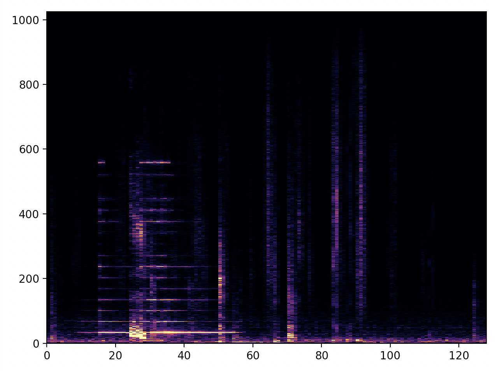

# Realtime Spectrogram of microphone audio signal

## Dependencies:

* Python 3
* Numpy
* Scipy
* Pyaudio
* Matplotlib

## How to run

```
python3 mic_fft.py
```

## Description

* Select first input device (usually microphone from laptop)
* Sampling at 16 KHz
* Spectrogram frequency axis is from 0 to 8KHz
* Almost realtime. However, samples are dropped from time to time

## Example



## TODO:

* Correct tick labels on axes
* Makes it truely realtime

